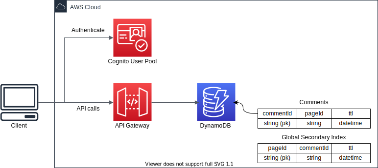

# Amazon API Gateway to DynamoDB integration with Amazon Cognito as authorizer



This is a Amazon API Gateway to DynamoDB integration with Amazon Cognito as authorizer project for Python development with CDK.

The `cdk.json` file tells the CDK Toolkit how to execute your app.

This project is set up like a standard Python project.  The initialization
process also creates a virtualenv within this project, stored under the `.venv`
directory.  To create the virtualenv it assumes that there is a `python3`
(or `python` for Windows) executable in your path with access to the `venv`
package. If for any reason the automatic creation of the virtualenv fails,
you can create the virtualenv manually.

To manually create a virtualenv on MacOS and Linux:

```
$ python3 -m venv .venv
```

After the init process completes and the virtualenv is created, you can use the following
step to activate your virtualenv.

```
$ source .venv/bin/activate
```

If you are a Windows platform, you would activate the virtualenv like this:

```
% .venv\Scripts\activate.bat
```

Once the virtualenv is activated, you can install the required dependencies.

```
(.venv) $ pip install -r requirements.txt
```

At this point you can now synthesize the CloudFormation template for this code.

```
(.venv) $ export CDK_DEFAULT_ACCOUNT=$(aws sts get-caller-identity --query Account --output text)
(.venv) $ export CDK_DEFAULT_REGION=$(curl -s 169.254.169.254/latest/dynamic/instance-identity/document | jq -r .region)
(.venv) $ cdk synth
```

Use `cdk deploy` command to create the stack shown above,

```
(.venv) $ cdk deploy --require-approval never
```

To add additional dependencies, for example other CDK libraries, just add
them to your `setup.py` file and rerun the `pip install -r requirements.txt`
command.

#### DynamoDB Table Desecriptions

 * Comments: store comments for each page of your website.
    <pre>
    {
      "TableName": "Comments",
      "KeySchema": [
        {
          "AttributeName": "commentId",
          "KeyType": "HASH"
        }
      ],
      "AttributeDefinitions": [
        {
          "AttributeName": "commentId",
          "AttributeType": "S"
        },
        {
          "AttributeName": "pageId",
          "AttributeType": "S"
        }
      ],
      "GlobalSecondaryIndexes": [
        {
          "IndexName": "pageId-index",
          "KeySchema": [
            {
              "AttributeName": "pageId",
              "KeyType": "HASH"
            }
          ],
          "Projection": {
              "ProjectionType": "ALL"
          }
        }
      ]
    }
    </pre>

#### API Definitions

 * Post Comments
    <pre>
    Resource: /comments
    HTTP Method: POST
    HTTP Request Body:
    {
      "pageId":   "example-page-id",
      "userName": "ExampleUserName",
      "message":  "This is an example comment to be added."
    }
    </pre>

 * Get Comments
    <pre>
    Resource: /comments/{pageId}
    HTTP Method: GET
    </pre>

## Testing the Cognito JWT Authorizer

Let's test if our lambda function is protected by the authorizer.
In order to test the flow we have to:

1. Register a Cognito User, using the aws cli
   <pre>
   aws cognito-idp sign-up \
     --client-id <i>your-user-pool-client-id</i> \
     --username "<i>user-email-id@domain.com</i>" \
     --password "<i>user-password</i>"
   </pre>
   Note: You can find `UserPoolClientId` with the following command:
   <pre>
   aws cloudformation describe-stacks --stack-name <i>your-clouformation-stack-name</i> | jq -r '.Stacks[0].Outputs | map(select(.OutputKey == "UserPoolClientId")) | .[0].OutputValue'
   </pre>

2. Confirm the user, so they can log in:
   <pre>
   aws cognito-idp admin-confirm-sign-up \
     --user-pool-id <i>your-user-pool-id</i> \
     --username "<i>user-email-id@domain.com</i>"
   </pre>
   At this point if you look at your cognito user pool, you would see that the user is confirmed and ready to log in:
   

   Note: You can find `UserPoolId` with the following command:
   <pre>
   aws cloudformation describe-stacks --stack-name <i>your-clouformation-stack-name</i> | jq -r '.Stacks[0].Outputs | map(select(.OutputKey == "UserPoolId")) | .[0].OutputValue'
   </pre>

3. Log the user in to get an identity JWT token
   <pre>
   aws cognito-idp initiate-auth \
     --auth-flow USER_PASSWORD_AUTH \
     --auth-parameters USERNAME="<i>user-email-id@domain.com</i>",PASSWORD="<i>user-password</i>" \
     --client-id <i>your-user-pool-client-id</i>
   </pre>

4. Hit our Api to test the Authorizer; use the token to invoke our API endpoint which will call the function (if the token is valid) <br/>
  * First we will put a record into DynamoDB, for example such as:
    <pre>
    {
      "pageId":   "breaking-news-story-01-18-2016",
      "userName": "Just Saying Thank You",
      "message":  "I really enjoyed this story!!"
    }
    </pre>

  * Run post comments api like this:
    <pre>
    MY_ID_TOKEN=$(aws cognito-idp initiate-auth --auth-flow USER_PASSWORD_AUTH --auth-parameters USERNAME="<i>user-email-id@domain.com</i>",PASSWORD="<i>user-password</i>" --client-id <i>your-user-pool-client-id</i> | jq -r '.AuthenticationResult.IdToken')

    curl -L -X POST '<i>your-api-url</i>/comments/' --header "Authorization: ${MY_ID_TOKEN}" \
      -d '{"pageId":"breaking-news-story-01-18-2016", "userName":"Just Saying Thank You", "message":"I really enjoyed this story!!"}' \
      -H 'Content-Type: application/json'
    </pre>
    The response is:
    <pre>
    {}
    </pre>

    Navigate to the DynamoDB console and view the `Comments` table to show that the request really was successfully processed.

  * Now let's try to retrieve data from our DynamoDB:
    <pre>
    MY_ID_TOKEN=$(aws cognito-idp initiate-auth --auth-flow USER_PASSWORD_AUTH --auth-parameters USERNAME="<i>user-email-id@domain.com</i>",PASSWORD="<i>user-password</i>" --client-id <i>your-user-pool-client-id</i> | jq -r '.AuthenticationResult.IdToken')

    curl -L -X GET '<i>your-api-url</i>/comments/breaking-news-story-01-18-2016' --header "Authorization: ${MY_ID_TOKEN}"
    </pre>
    The response is:
    <pre>
    {
      "comments": [
        {
          "commentId": "d4e373b5-9977-45e9-8855-ecacd160c108",
          "userName": "Just Saying Thank You",
          "message": "I really enjoyed this story!!"
        }
      ]
    }
    </pre>

  * Note: You can find <i>your-api-url</i> with the following command:
    <pre>
    aws cloudformation describe-stacks --stack-name <i>your-clouformation-stack-name</i> | jq -r '.Stacks[0].Outputs | map(select(.ExportName == "ApiGatewayRestApiEndpoint")) | .[0].OutputValue'
    </pre>

## Useful commands

 * `cdk ls`          list all stacks in the app
 * `cdk synth`       emits the synthesized CloudFormation template
 * `cdk deploy`      deploy this stack to your default AWS account/region
 * `cdk diff`        compare deployed stack with current state
 * `cdk docs`        open CDK documentation

Enjoy!

## References

 * [Using Amazon API Gateway as a proxy for DynamoDB](https://aws.amazon.com/blogs/compute/using-amazon-api-gateway-as-a-proxy-for-dynamodb/)
 * [Amazon API Gateway REST API to DynamoDB](https://serverlessland.com/patterns/apigw-dynamodb)
 * [Amazon API Gateway mapping template and access logging variable reference](https://docs.aws.amazon.com/apigateway/latest/developerguide/api-gateway-mapping-template-reference.html)
