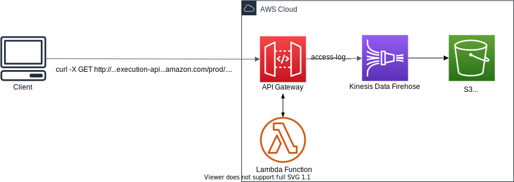

# Logging Amazon API Gateway API Calls to Kinesis Data Firehose



This is a CDK Python project for logging API calls to Amazon Kinesis Data Firehose.

The `cdk.json` file tells the CDK Toolkit how to execute your app.

This project is set up like a standard Python project.  The initialization
process also creates a virtualenv within this project, stored under the `.venv`
directory.  To create the virtualenv it assumes that there is a `python3`
(or `python` for Windows) executable in your path with access to the `venv`
package. If for any reason the automatic creation of the virtualenv fails,
you can create the virtualenv manually.

To manually create a virtualenv on MacOS and Linux:

```
$ python3 -m venv .venv
```

After the init process completes and the virtualenv is created, you can use the following
step to activate your virtualenv.

```
$ source .venv/bin/activate
```

If you are a Windows platform, you would activate the virtualenv like this:

```
% .venv\Scripts\activate.bat
```

Once the virtualenv is activated, you can install the required dependencies.

```
(.venv) $ pip install -r requirements.txt
```

At this point you can now synthesize the CloudFormation template for this code.

<pre>
(.venv) $ export CDK_DEFAULT_ACCOUNT=$(aws sts get-caller-identity --query Account --output text)
(.venv) $ export CDK_DEFAULT_REGION=$(curl -s 169.254.169.254/latest/dynamic/instance-identity/document | jq -r .region)
(.venv) $ cdk synth -c firehose_name=amazon-apigateway-<i>{your-delivery-stream-name}</i>
</pre>

:warning: The name of your Kinesis Data Firehose delivery stream must be **amazon-apigateway-**<i>{your-delivery-stream-name}</i>.

Use `cdk deploy` command to create the stack shown above,

<pre>
(.venv) $ cdk deploy -c firehose_name=amazon-apigateway-<i>{your-delivery-stream-name}</i>
</pre>

To add additional dependencies, for example other CDK libraries, just add
them to your `setup.py` file and rerun the `pip install -r requirements.txt`
command.

## Useful commands

 * `cdk ls`          list all stacks in the app
 * `cdk synth`       emits the synthesized CloudFormation template
 * `cdk deploy`      deploy this stack to your default AWS account/region
 * `cdk diff`        compare deployed stack with current state
 * `cdk docs`        open CDK documentation

Enjoy!

## Run Test

1. Invoke REST API method
   <pre>
   $ curl -X GET 'https://<i>{your-api-gateway-id}</i>.execute-api.<i>{region}</i>.amazonaws.com/prod/random/strings?len=7'
   </pre>

   The response is:
   <pre>
   ["weBJDKv"]
   </pre>

2. Generate test requests and run them.
   <pre>
   $ cat <&lt;EOF > run_test.sh
   > curl 'https://<i>{your-api-gateway-id}</i>.execute-api.<i>{region}</i>.amazonaws.com/prod/random/strings?len=7'
   > curl 'https://<i>{your-api-gateway-id}</i>.execute-api.<i>{region}</i>.amazonaws.com/prod/random/strings?chars=letters'
   > curl 'https://<i>{your-api-gateway-id}</i>.execute-api.<i>{region}</i>.amazonaws.com/prod/random/strings?chars=letters&len=15'
   > curl 'https://<i>{your-api-gateway-id}</i>.execute-api.<i>{region}</i>.amazonaws.com/prod/random/strings?chars=lowercase&len=15'
   > curl 'https://<i>{your-api-gateway-id}</i>.execute-api.<i>{region}</i>.amazonaws.com/prod/random/strings?chars=uppercase&len=5'
   > curl 'https://<i>{your-api-gateway-id}</i>.execute-api.<i>{region}</i>.amazonaws.com/prod/random/strings?chars=digits&len=7'
   > curl 'https://<i>{your-api-gateway-id}</i>.execute-api.<i>{region}</i>.amazonaws.com/prod/random/strings?chars=digits&len=17'
   > curl 'https://<i>{your-api-gateway-id}</i>.execute-api.<i>{region}</i>.amazonaws.com/prod/random/strings?len=3'
   > curl 'https://<i>{your-api-gateway-id}</i>.execute-api.<i>{region}</i>.amazonaws.com/prod/random/strings?chars=letters&len=9'
   > curl 'https://<i>{your-api-gateway-id}</i>.execute-api.<i>{region}</i>.amazonaws.com/prod/random/strings?len=17'
   > EOF
   $ bash ./run_test.sh
   </pre>

3. Check the access logs in S3

   After 5~10 minutes, you can see that the access logs have been delivered by **Kinesis Data Firehose** to **S3** and stored in a folder structure by year, month, day, and hour.

   

## References

 * [Amazon API Gateway - Logging API calls to Kinesis Data Firehose](https://docs.aws.amazon.com/apigateway/latest/developerguide/apigateway-logging-to-kinesis.html)
 * [Setting up CloudWatch logging for a REST API in API Gateway](https://docs.aws.amazon.com/apigateway/latest/developerguide/set-up-logging.html)
 * [How to resolve "Invalid permissions on Lambda function" errors from API Gateway REST APIs](https://aws.amazon.com/premiumsupport/knowledge-center/api-gateway-rest-api-lambda-integrations/)
 * [Curl Cookbook](https://catonmat.net/cookbooks/curl)

