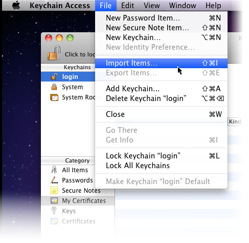
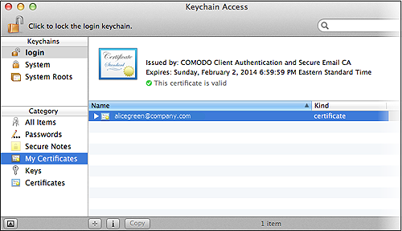

# Creating Jupyter Notebook Server using Amazon Deep Learning AMI (DLAMI)

The `cdk.json` file tells the CDK Toolkit how to execute your app.

This project is set up like a standard Python project.  The initialization
process also creates a virtualenv within this project, stored under the `.venv`
directory.  To create the virtualenv it assumes that there is a `python3`
(or `python` for Windows) executable in your path with access to the `venv`
package. If for any reason the automatic creation of the virtualenv fails,
you can create the virtualenv manually.

To manually create a virtualenv on MacOS and Linux:

```
$ python3 -m venv .venv
```

After the init process completes and the virtualenv is created, you can use the following
step to activate your virtualenv.

```
$ source .venv/bin/activate
```

If you are a Windows platform, you would activate the virtualenv like this:

```
% .venv\Scripts\activate.bat
```

Once the virtualenv is activated, you can install the required dependencies.

```
(.venv) $ pip install -r requirements.txt
```

At this point you can now synthesize the CloudFormation template for this code.

<pre>
(.venv) $ cdk synth \
              -c vpc_name="<i>your-existing-vpc-name</i>" \
              -c dlami_name="<i>DLAMI-name</i>" \
              -c ec2_key_pair_name="<i>your-ec2-key-pair-name(exclude .pem extension)</i>" \
              -c jupyter_notebook_instance_type="<i>your-ec2-instance-type</i>"
</pre>

Use `cdk deploy` command to create the stack shown above.

<pre>
(.venv) $ cdk deploy \
              -c vpc_name="<i>your-existing-vpc-name</i>" \
              -c dlami_name="<i>DLAMI-name</i>" \
              -c ec2_key_pair_name="<i>your-ec2-key-pair-name(exclude .pem extension)</i>" \
              -c jupyter_notebook_instance_type="<i>your-ec2-instance-type</i>"
</pre>

To add additional dependencies, for example other CDK libraries, just add
them to your `setup.py` file and rerun the `pip install -r requirements.txt`
command.

## Set up to access Jupyter Notebook Server on Local MacOS PC

#### Copy Jupter Notebook CA from EC2 instance

- Copy certificate file for Jupyter notebook into your local computer (e.g. MacOS)
  <pre>
  $ scp -i ~/.ssh/<i>your-ec2-key-pair-name(include .pem extension)</i> ec2-user@<i>jupyter-instance-public-ip</i>:/home/ec2-user/certificate/mycert.pem ./mycert.pem
  </pre>

#### Import Jupyter Certificate into a Mac OS using Keychain Access

1. Click **Applications > Utilities > Keychain Access**
2. In the **Keychains** menu on the left, select **Login** then **File > Import Items...**
   
   

3. Navigate to the location of your saved certificate file and click **Open**.
4. Enter the key pair's password and click **OK**.<br/>
   **Note**: If prompted to trust certificates issued by your CA automatically, select the **Always Trust** option to trust and install your certificate.
   The certificate will be installed and can be viewed by clicking **Category > My Certificates** in the Keychain Access utility.

   

#### Configure a Linux or macOS Client
1. Open a terminal.
2. Add a ssh tunnel configuration to the ssh config file of the personal local PC as follows:
<pre>
# Jupyter Notebook Server Tunnel
Host nbtunnel
   HostName <i>EC2-Public-IP</i>
   User ec2-user
   IdentitiesOnly yes
   IdentityFile <i>Path-to-SSH-Public-Key</i>
   LocalForward 8888 <i>ec2-###-###-###-###.compute-1.amazonaws.com</i>:8888
</pre>

ex)

<pre>
~$ ls -1 .ssh/
config
my-ec2-key-pair.pem

~$ tail .ssh/config
# Jupyter Notebook Server Tunnel
Host nbtunnel
   HostName 214.132.71.219
   User ec2-user
   IdentitiesOnly yes
   IdentityFile ~/.ssh/my-ec2-key-pair.pem
   LocalForward 8888 <i>ec2-214-132-71-219.compute-1.amazonaws.com</i>:8888

~$
</pre>

3. In the address bar of your browser, type the following URL, or click on this link: [https://localhost:8888](https://localhost:8888)
   For more information, see [Test by Logging in to the Jupyter notebook server](https://docs.aws.amazon.com/dlami/latest/devguide/setup-jupyter-login.html)

## Useful commands

 * `cdk ls`          list all stacks in the app
 * `cdk synth`       emits the synthesized CloudFormation template
 * `cdk deploy`      deploy this stack to your default AWS account/region
 * `cdk diff`        compare deployed stack with current state
 * `cdk docs`        open CDK documentation

Enjoy!

## References

 * [Release Notes for Amazon DLAMI](https://docs.aws.amazon.com/dlami/latest/devguide/appendix-ami-release-notes.html)
 * [Deep Learning AMI - Set up a Jupyter Notebook Server](https://docs.aws.amazon.com/dlami/latest/devguide/setup-jupyter.html)
 * [How to Import and Export a Client Personal Authentication Certificate on Mac OS X Keychain Access](https://sectigo.com/faqs/detail/How-to-Import-and-Export-a-Client-Personal-Authentication-Certificate-on-Mac-OS-X-Keychain-Access/kA03l000000vFhu)
 * [주피터 (Jupyter Notebook) 설치하여 웹브라우저로 서버 관리 - 우분투](https://hithot.tistory.com/74)
 * [Preparing data for ML models using AWS Glue DataBrew in a Jupyter notebook](https://aws.amazon.com/blogs/big-data/preparing-data-for-ml-models-using-aws-glue-databrew-in-a-jupyter-notebook/)
   * [AWS Glue Databrew Jupyter extension](https://github.com/aws/aws-glue-databrew-jupyter-extension/tree/main/blogpost/cloudformation)
 * [Jupyter Lab gets killed with message "received signal 15, stopping"](https://discourse.jupyter.org/t/jupyter-lab-gets-killed-with-message-received-signal-15-stopping/9512/4)
 * [How can I send user-data output to the console logs on an EC2 instance running Amazon Linux or Amazon Linux 2?](https://aws.amazon.com/premiumsupport/knowledge-center/ec2-linux-log-user-data/)
   * The following is the line that redirects the user-data output:
     ```
     exec > >(tee /var/log/user-data.log|logger -t user-data -s 2>/dev/console) 2>&1
     ```

