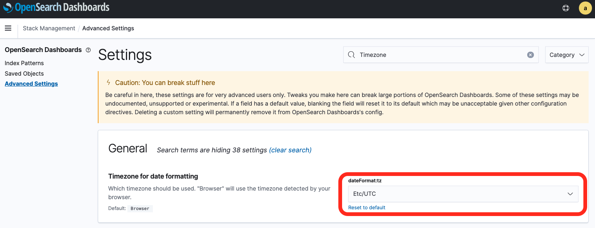

# Amazon OpenSearch Service


This is a project for Python development with CDK.

The `cdk.json` file tells the CDK Toolkit how to execute your app.

This project is set up like a standard Python project.  The initialization
process also creates a virtualenv within this project, stored under the `.venv`
directory.  To create the virtualenv it assumes that there is a `python3`
(or `python` for Windows) executable in your path with access to the `venv`
package. If for any reason the automatic creation of the virtualenv fails,
you can create the virtualenv manually.

To manually create a virtualenv on MacOS and Linux:

```
$ python3 -m venv .venv
```

After the init process completes and the virtualenv is created, you can use the following
step to activate your virtualenv.

```
$ source .venv/bin/activate
```

If you are a Windows platform, you would activate the virtualenv like this:

```
% .venv\Scripts\activate.bat
```

Once the virtualenv is activated, you can install the required dependencies.

```
(.venv) $ pip install -r requirements.txt
```

At this point you can now synthesize the CloudFormation template for this code.

<pre>
(.venv) $ cdk synth \
              --parameters OpenSearchDomainName="<i>your-opensearch-domain-name</i>" \
              --parameters EC2KeyPairName="<i>your-ec2-key-pair-name</i>"
</pre>

Use `cdk deploy` command to create the stack shown above.

<pre>
(.venv) $ cdk deploy \
              --parameters OpenSearchDomainName="<i>your-opensearch-domain-name</i>" \
              --parameters EC2KeyPairName="<i>your-ec2-key-pair-name</i>"
</pre>

To add additional dependencies, for example other CDK libraries, just add
them to your `setup.py` file and rerun the `pip install -r requirements.txt`
command.

### A note about Service-Linked Role
Some cluster configurations (e.g VPC access) require the existence of the `AWSServiceRoleForAmazonElasticsearchService` Service-Linked Role.

When performing such operations via the AWS Console, this SLR is created automatically when needed. However, this is not the behavior when using CloudFormation. If an SLR(Service-Linked Role) is needed, but doesn’t exist, you will encounter a failure message simlar to:

<pre>
Before you can proceed, you must enable a service-linked role to give Amazon OpenSearch Service...
</pre>

To resolve this, you need to [create](https://docs.aws.amazon.com/IAM/latest/UserGuide/using-service-linked-roles.html#create-service-linked-role) the SLR. We recommend using the AWS CLI:

```
aws iam create-service-linked-role --aws-service-name es.amazonaws.com
```

## Useful commands

 * `cdk ls`          list all stacks in the app
 * `cdk synth`       emits the synthesized CloudFormation template
 * `cdk deploy`      deploy this stack to your default AWS account/region
 * `cdk diff`        compare deployed stack with current state
 * `cdk docs`        open CDK documentation

Enjoy!

## Remotely access your Amazon OpenSearch Cluster using SSH tunnel from local machine
1. To access the OpenSearch Cluster, add the ssh tunnel configuration to the ssh config file of the personal local PC as follows

    <pre>
    # OpenSearch Tunnel
    Host opstunnel
        HostName <i>EC2-Public-IP-of-Bastion-Host</i>
        User ec2-user
        IdentitiesOnly yes
        IdentityFile <i>Path-to-SSH-Public-Key</i>
        LocalForward 9200 <i>OpenSearch-Endpoint</i>:443
    </pre>

    ex)

    ```
    ~$ ls -1 .ssh/
    config
    my-ec2-key-pair.pem

    ~$ tail .ssh/config
    # OpenSearch Tunnel
    Host opstunnel
        HostName 214.132.71.219
        User ec2-user
        IdentitiesOnly yes
        IdentityFile ~/.ssh/my-ec2-key-pair.pem
        LocalForward 9200 vpc-search-domain-qvwlxanar255vswqna37p2l2cy.us-east-1.es.amazonaws.com:443

    ~$
    ```

    You can find the bastion host's public ip address as running the commands like this:

    <pre>
    $ BASTION_HOST_ID=$(aws cloudformation describe-stacks --stack-name <i>your-cloudformation-stack-name</i> | jq -r '.Stacks[0].Outputs | map(select(.OutputKey == "BastionHostBastionHostId")) | .[0].OutputValue')
    $ aws ec2 describe-instances --instance-ids ${BASTION_HOST_ID} | jq -r '.Reservations[0].Instances[0].PublicIpAddress'
    </pre>

2. Run `ssh -N opstunnel` in Terminal.
3. Connect to `https://localhost:9200/_dashboards/` in a web browser.
4. Enter the master user and password that you set up when you created the Amazon OpenSearch Service endpoint.
5. In the Welcome screen, click the toolbar icon to the left side of **Home** button. Choose **Stack Managerment**
   
6. After selecting **Advanced Settings** from the left sidebar menu, set **Timezone** for date formatting to `Etc/UTC`.
   Since the log creation time of the test data is based on UTC, OpenSearch Dashboard’s Timezone is also set to UTC.
   
7. If you would like to access the OpenSearch Cluster in a termial, open another terminal window, and then run the following commands: (in here, <i>`your-cloudformation-stack-name`</i> is `OpensearchStack`)

    <pre>
    $ MASTER_USER_SECRET_ID=$(aws cloudformation describe-stacks --stack-name <i>your-cloudformation-stack-name</i> | jq -r '.Stacks[0].Outputs | map(select(.OutputKey == "MasterUserSecretId")) | .[0].OutputValue')
    $ export OPS_SECRETS=$(aws secretsmanager get-secret-value --secret-id ${MASTER_USER_SECRET_ID} | jq -r '.SecretString | fromjson | "\(.username):\(.password)"')
    $ export OPS_DOMAIN=$(aws cloudformation describe-stacks --stack-name <i>your-cloudformation-stack-name</i> | jq -r '.Stacks[0].Outputs | map(select(.OutputKey == "OpenSearchDomainEndpoint")) | .[0].OutputValue')
    $ curl -XGET --insecure -u "${OPS_SECRETS}" https://localhost:9200/_cluster/health?pretty=true
    $ curl -XGET --insecure -u "${OPS_SECRETS}" https://localhost:9200/_cat/nodes?v
    $ curl -XGET --insecure -u "${OPS_SECRETS}" https://localhost:9200/_nodes/stats?pretty=true
    </pre>

#### References
- [Windows SSH / Tunnel for Kibana Instructions - Amazon Elasticsearch Service](https://search-sa-log-solutions.s3-us-east-2.amazonaws.com/logstash/docs/Kibana_Proxy_SSH_Tunneling_Windows.pdf)
- [Use an SSH Tunnel to access Kibana within an AWS VPC with PuTTy on Windows](https://amazonmsk-labs.workshop.aws/en/mskkdaflinklab/createesdashboard.html)
- [OpenSearch Popular APIs](https://opensearch.org/docs/latest/opensearch/popular-api/)
