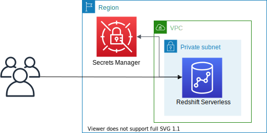

# Amzon Redshift Serverless CDK Python project!



This is a Amzon Redshift Serverless project for CDK development with Python.

The `cdk.json` file tells the CDK Toolkit how to execute your app.

This project is set up like a standard Python project.  The initialization
process also creates a virtualenv within this project, stored under the `.venv`
directory.  To create the virtualenv it assumes that there is a `python3`
(or `python` for Windows) executable in your path with access to the `venv`
package. If for any reason the automatic creation of the virtualenv fails,
you can create the virtualenv manually.

To manually create a virtualenv on MacOS and Linux:

```
$ python3 -m venv .venv
```

After the init process completes and the virtualenv is created, you can use the following
step to activate your virtualenv.

```
$ source .venv/bin/activate
```

If you are a Windows platform, you would activate the virtualenv like this:

```
% .venv\Scripts\activate.bat
```

Once the virtualenv is activated, you can install the required dependencies.

```
$ pip install -r requirements.txt
```

:information_source: Before you deploy this project, you should create an AWS Secret for your Redshift Serverless Admin user. You can create an AWS Secret like this:

<pre>
$ aws secretsmanager create-secret \
    --name "<i>your_redshift_secret_name</i>" \
    --description "<i>(Optional) description of the secret</i>" \
    --secret-string '{"admin_username": "admin", "admin_user_password": "<i>password_of_at_last_8_characters</i>"}'
</pre>

At this point you can now synthesize the CloudFormation template for this code.

<pre>
(.venv) $ export CDK_DEFAULT_ACCOUNT=$(aws sts get-caller-identity --query Account --output text)
(.venv) $ export CDK_DEFAULT_REGION=$(curl -s 169.254.169.254/latest/dynamic/instance-identity/document | jq -r .region)
(.venv) $ cdk synth \
              -c vpc_name='<i>your-existing-vpc-name</i>' \
              -c aws_secret_name='<i>your_redshift_secret_name</i>'
</pre>

Use `cdk deploy` command to create the stack shown above.

<pre>
(.venv) $ cdk deploy \
              -c vpc_name='<i>your-existing-vpc-name</i>' \
              -c aws_secret_name='<i>your_redshift_secret_name</i>'
</pre>

To add additional dependencies, for example other CDK libraries, just add
them to your `setup.py` file and rerun the `pip install -r requirements.txt`
command.

## Clean Up

Delete the CloudFormation stack by running the below command.

<pre>
(.venv) $ cdk destroy --force \
              -c vpc_name='<i>your-existing-vpc-name</i>' \
              -c aws_secret_name=<i>your_redshift_secret_name</i>
</pre>

## Useful commands

 * `cdk ls`          list all stacks in the app
 * `cdk synth`       emits the synthesized CloudFormation template
 * `cdk deploy`      deploy this stack to your default AWS account/region
 * `cdk diff`        compare deployed stack with current state
 * `cdk docs`        open CDK documentation

Enjoy!

## References

 * [Automate Amazon Redshift Serverless data warehouse management using AWS CloudFormation and the AWS CLI (2022-10-19)](https://aws.amazon.com/ko/blogs/big-data/automate-amazon-redshift-serverless-data-warehouse-management-using-aws-cloudformation-and-the-aws-cli/)
 * [Introducing Amazon Redshift Serverless – Run Analytics At Any Scale Without Having to Manage Data Warehouse Infrastructure (2021-11-30)](https://aws.amazon.com/ko/blogs/aws/introducing-amazon-redshift-serverless-run-analytics-at-any-scale-without-having-to-manage-infrastructure/)

## Learn More

 * [Easy analytics and cost-optimization with Amazon Redshift Serverless (2022-08-30)](https://aws.amazon.com/ko/blogs/big-data/easy-analytics-and-cost-optimization-with-amazon-redshift-serverless/)
 * [Develop an Amazon Redshift ETL serverless framework using RSQL, AWS Batch, and AWS Step Functions (2022-08-02)](https://aws.amazon.com/ko/blogs/big-data/develop-an-amazon-redshift-etl-serverless-framework-using-rsql-aws-batch-and-aws-step-functions/)
 * [Real-time analytics with Amazon Redshift streaming ingestion (2022-04-27)](https://aws.amazon.com/ko/blogs/big-data/real-time-analytics-with-amazon-redshift-streaming-ingestion/)
 * [How to Simplify Machine Learning with Amazon Redshift (2021-11-21)](https://aws.amazon.com/ko/blogs/apn/how-to-simplify-machine-learning-with-amazon-redshift/)
 * [Build regression models with Amazon Redshift ML (2021-06-03)](https://aws.amazon.com/ko/blogs/machine-learning/build-regression-models-with-amazon-redshift-ml/)

