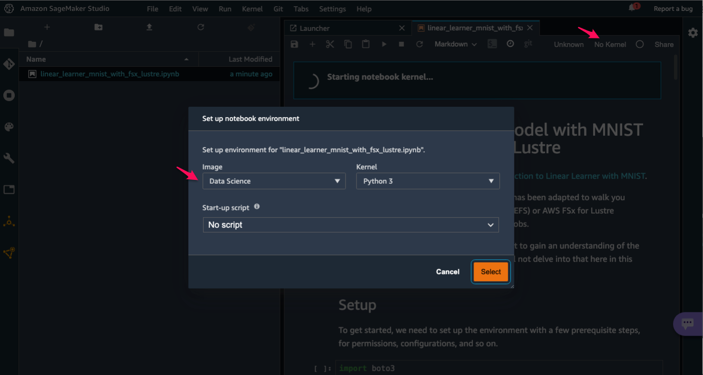
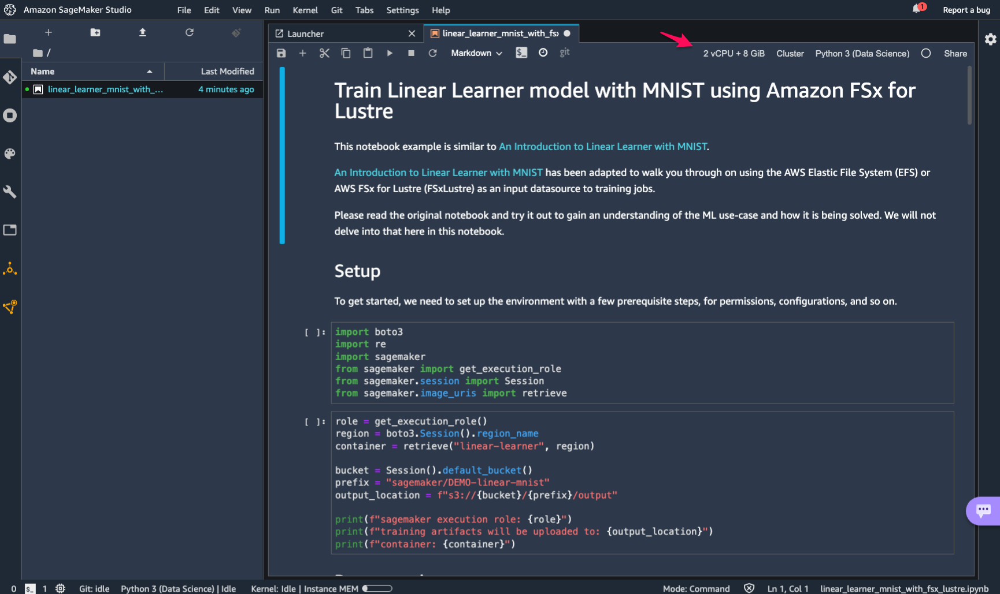
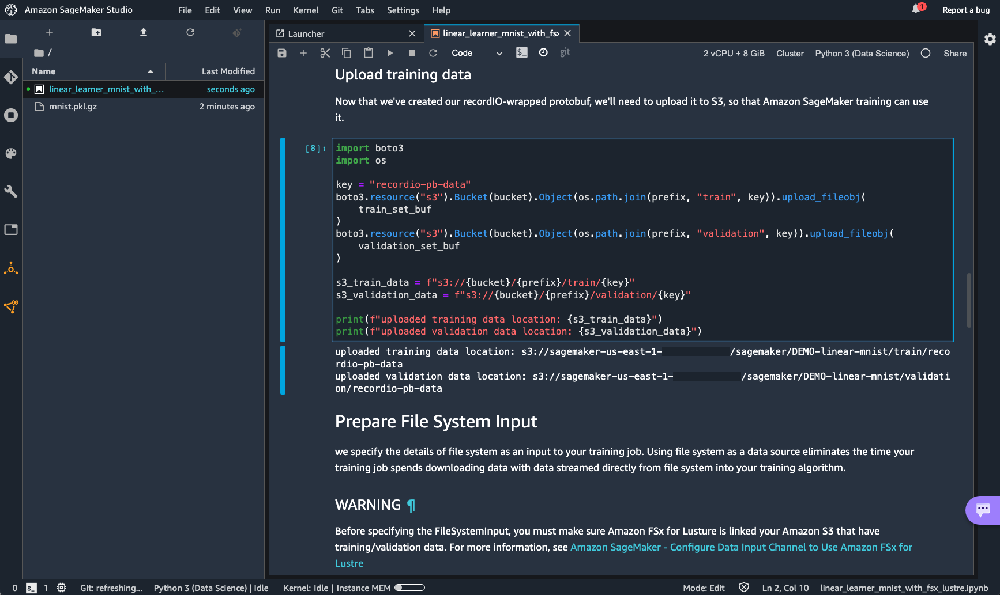
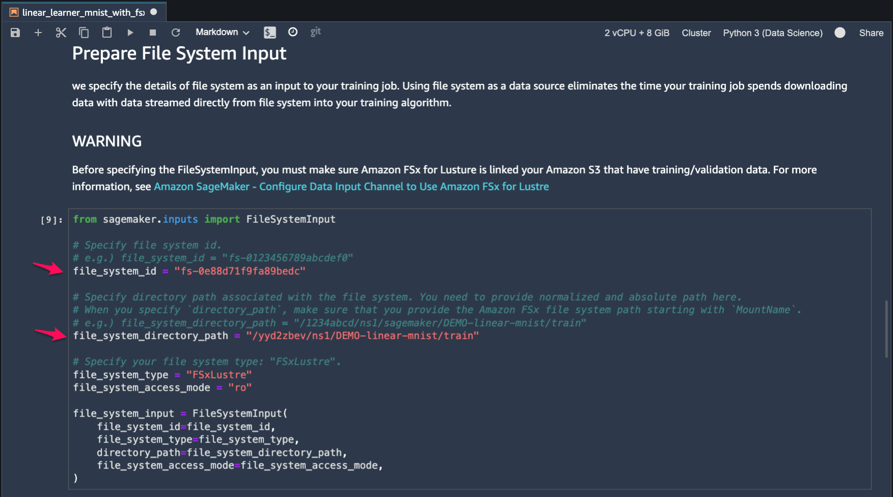
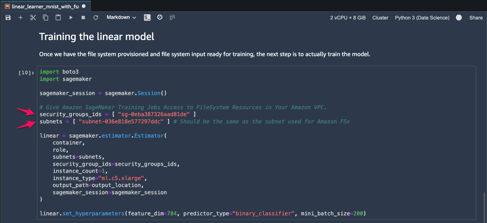

# SageMaker Training Jobs with Amazon FSx for Lustre

This CDK Python project walks you through on using the AWS FSx for Lustre (FSxLustre) as an input data source to training jobs in Amazon SageMaker.

The `cdk.json` file tells the CDK Toolkit how to execute your app.

This project is set up like a standard Python project.  The initialization
process also creates a virtualenv within this project, stored under the `.venv`
directory.  To create the virtualenv it assumes that there is a `python3`
(or `python` for Windows) executable in your path with access to the `venv`
package. If for any reason the automatic creation of the virtualenv fails,
you can create the virtualenv manually.

To manually create a virtualenv on MacOS and Linux:

```
$ python3 -m venv .venv
```

After the init process completes and the virtualenv is created, you can use the following
step to activate your virtualenv.

```
$ source .venv/bin/activate
```

If you are a Windows platform, you would activate the virtualenv like this:

```
% .venv\Scripts\activate.bat
```

Once the virtualenv is activated, you can install the required dependencies.

```
(.venv) $ pip install -r requirements.txt
```

To add additional dependencies, for example other CDK libraries, just add
them to your `setup.py` file and rerun the `pip install -r requirements.txt`
command.

At this point you can now synthesize the CloudFormation template for this code.

<pre>
(.venv) $ cdk synth --all \
              -c vpc_name=<i>your-existing-vpc-name</i> \
              -c data_repository_path="s3://<i>{bucket}</i>/<i>{prefix}</i>" \
              -c file_system_path="/<i>your-file-system-path-to-be-associated-data-repository</i>"
</pre>

For example,

<pre>
(.venv) $ cdk synth --all \
              -c vpc_name=<i>default</i> \
              -c data_repository_path="s3://<i>sagemaker-us-east-1-123456789012</i>/<i>sagemaker</i>/" \
              -c file_system_path="/<i>ns1</i>"
</pre>

## Run Test

#### (Step 1) Check cdk stacks
  Before deploying CDK stacks, let's check the list of stacks with `cdk list` command.
   <pre>
   (.venv) $ cdk list
   SageMakerFSxLustreVPC
   SageMakerStudioWithFSxLustre
   FSxLustreForSageMakerStack
   FSxLustreDataRepositoryForSageMakerStack
   </pre>

#### (Step 2) Deploy SageMaker Studio Stack.
   <pre>
   (.venv) $ cdk deploy --require-approval never SageMakerFSxLustreVPC SageMakerStudioWithFSxLustre
   </pre>

#### (Step 3) Upload an example notebook.
  

#### (Step 4) Set up the notebook environment
  
  The notebook is now running ...
  

#### (Step 5) Run cells in the example notebook by **Upload training data** step.
  

#### (Step 6) Provision FSx for Lustre and link the file system to an S3 bucket for training data
   come back to your terminal, and then deploy the remaining cdk stacks
   <pre>
   (.venv) $ cdk deploy --require-approval never FSxLustreForSageMakerStack FSxLustreDataRepositoryForSageMakerStack
   </pre>

#### (Step 7) Run cells in the example notebook from **Prepare File System Input** step.
   In order to prepare FileSystemInput, we need to the file system id and directory path associated with the file sytem.
 
   We can get the file system id from [Amazon FSx console](https://console.aws.amazon.com/fsx/home).
  
  
   Then we can get `MountName` by running `aws fsx describe-file-systems` command like this:
   <pre>
   (.venv) $ aws fsx describe-file-systems | jq -r '.FileSystems[] | select(.FileSystemId == "fs-0e88d71f9fa89bedc") | {FileSystemId, "MountName": .LustreConfiguration.MountName }'
   {
     "FileSystemId": "fs-0e88d71f9fa89bedc",
     "MountName": "yyd2zbev"
   }
   </pre>
   For `DataRepositoryPath`, we can get it with the following command:
   <pre>
   (.venv) $ aws fsx describe-data-repository-associations | jq -r '.Associations[] | select(.FileSystemId=="fs-0e88d71f9fa89bedc") | {FileSystemId, FileSystemPath, DataRepositoryPath, Lifecycle}'
   {
    "FileSystemId": "fs-0e88d71f9fa89bedc",
    "FileSystemPath": "/ns1",
    "DataRepositoryPath": "s3://sagemaker-us-east-1-123456789012/sagemaker/",
    "Lifecycle": "AVAILABLE"
   }
   </pre>
   According to the data repository path information, the file system path, `/ns1` points to the `s3://sagemaker-us-east-1-123456789012/sagemaker/`. So, if the training data is in the `s3://sagemaker-us-east-1-123456789012/sagemaker/DEMO-linear-mnist/train`, we can specify the trainig data path as the format like <i>{mount_name}/{file_system_path}/{s3 object prefix}</i>, `/yyd2zbev/ns1/DEMO-linear-mnist/train`. <br/>
   We can think that `/yyd2zbev/ns1/` represents `s3://sagemaker-us-east-1-123456789012/sagemaker/`.

   Now we can run the cell to prepare the FileSystemInput.
   

#### (Step 8) Training the model.
   While a model is training, Amazon SageMaker Training Jobs need to access to FileSystem Resources in your Amazon VPC.<br/>
   So we need the subnet ids and the security group id for FSx for Lustre.
   We can get the subnet id by running the following command:
   <pre>
   (.venv) $ aws fsx describe-file-systems | jq -r '.FileSystems[] | select(.FileSystemId == "fs-0e88d71f9fa89bedc") | {FileSystemId, SubnetIds, NetworkInterfaceIds}'
   {
    "FileSystemId": "fs-0e88d71f9fa89bedc",
    "SubnetIds": [
      "subnet-036e818e577297ddc"
    ],
    "NetworkInterfaceIds": [
      "eni-007bf92bd02ca08ce"
    ]
   }
   </pre>
   In case of the security group id, we can get it with the network interface id like this:
   <pre>
   (.venv) $ aws ec2 describe-network-interfaces | jq -r '.NetworkInterfaces[] | select(.NetworkInterfaceId=="eni-007bf92bd02ca08ce") | .Groups[0].GroupId'
   sg-0eba387326aad81de
   </pre>
   With the subnet id and security group id, we create the SageMaker Training Job.
   
   Then we can run the training job.
   


## Useful commands

 * `cdk ls`          list all stacks in the app
 * `cdk synth`       emits the synthesized CloudFormation template
 * `cdk deploy`      deploy this stack to your default AWS account/region
 * `cdk diff`        compare deployed stack with current state
 * `cdk docs`        open CDK documentation

Enjoy!

## References

 * [Amazon SageMaker - Configure Data Input Channel to Use Amazon FSx for Lustre](https://docs.aws.amazon.com/sagemaker/latest/dg/model-access-training-data.html#model-access-training-data-fsx)
 * [Amazon FSx for Lustre - Linking your file system to an S3 bucket](https://docs.aws.amazon.com/fsx/latest/LustreGuide/create-dra-linked-data-repo.html)
 * [Choose the best data source for your Amazon SageMaker training job (2022-02-23)](https://aws.amazon.com/ko/blogs/machine-learning/choose-the-best-data-source-for-your-amazon-sagemaker-training-job/)
 * [Speed up training on Amazon SageMaker using Amazon FSx for Lustre and Amazon EFS file systems (2019-08-27)](https://aws.amazon.com/ko/blogs/machine-learning/speed-up-training-on-amazon-sagemaker-using-amazon-efs-or-amazon-fsx-for-lustre-file-systems/)
 * [SageMaker Example notebook - Train Linear Learner model using File System Data Source](https://github.com/aws/amazon-sagemaker-examples/blob/main/introduction_to_amazon_algorithms/linear_learner_mnist/linear_learner_mnist_with_file_system_data_source.ipynb)
